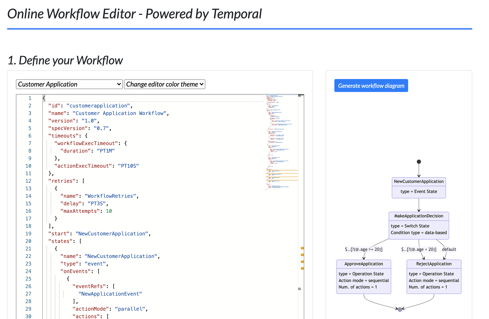
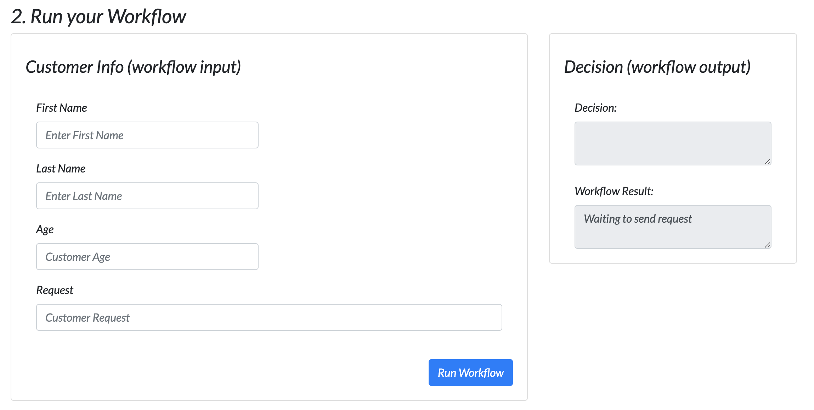
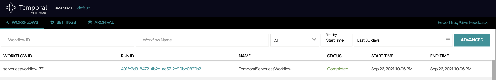
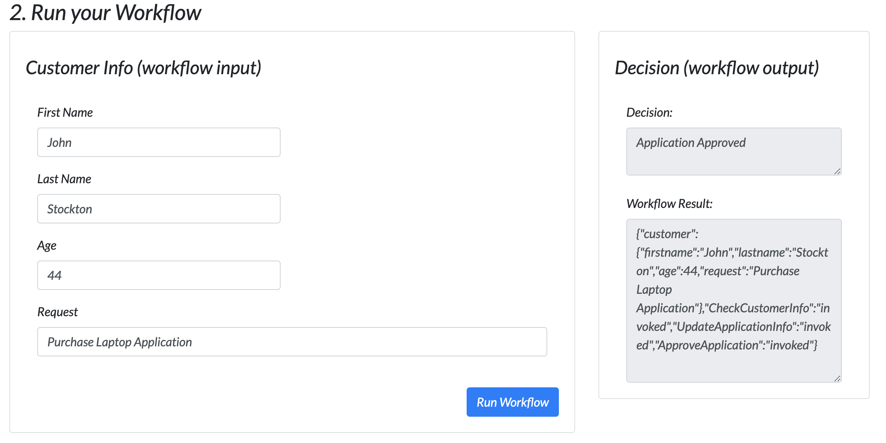

# Serverless Workflow Demo - Temporal execution

This demo shows the integration of [Serverless Workflow](https://serverlessworkflow.io/)
with [Temporal](https://temporal.io/)

It also shows the Serverless Workflow project experience,
where you can easily build an online editor, visualization,
form-based workflow data inputs and ability to start 
workflow execution and wait for results.

Note: this is a demo and not intended for production use.
The demo integration does not support 100% of the Serverless Workflow
specification, but the intent is that it does soon.

Note: Serverless Workflow specification supports standards-based
function executions, meaning it supports standards such as OpenApi,
AsyncApi, GraphQL, etc. For the integration SW functions align
to invocations of Temporal Activities. Temporal activities 
are functions where you can add your own code. For this demo
we did not implement (yet) actual invocation of 3rd party services.
Currently activities just simulate that work but irl that code
can be auto-generated using generators from for example OpenApi 
service definitions.

## About

Demo uses the [Temporal Java SDK](https://github.com/temporalio/sdk-java) to define a dynamic workflow capable
of executing instructions defined in the [Serverless Workflow DSL](https://github.com/serverlessworkflow/specification/tree/main/schema).
For that it uses the [Serverless Workflow Java SDK](https://github.com/serverlessworkflow/sdk-java) for validating and 
parsing the JSON (or yaml can be used too) DSL into an object model before interpreting it.

Note that the same type of demo can be produced 
for 
Golang - [Temporal Go SDK](https://github.com/temporalio/sdk-go), [Serverless Workflow Go SDK](https://github.com/serverlessworkflow/sdk-go)
TypeScript - [Temporal Typescript SDK](https://github.com/temporalio/sdk-node), [Serverless Workflow TypeScript SDK](https://github.com/serverlessworkflow/sdk-typescript)

If you would like to help with this one, or the other mentioned 
integrations let me know. 

This demo runs on [Quarkus](https://quarkus.io/).

This demo is a work in progress and will be improved over time. The integration 
can definitely be improved, especially on the passing data between the UI, Quarkus app and Temporal. 

## Start the demo app

### 1. Start Temporal Server on Docker

    git clone https://github.com/temporalio/docker-compose.git
    cd  docker-compose
    docker-compose -f docker-compose-cas-es.yml up

### 2. Start the demo app (Quarkus dev mode)

    mvn clean install quarkus:dev

## Interact with the demo

### 1. Access the demo

    http://localhost:8080

The top-part of the demo shows the Serverless Workflow online editor
and the dynamic graphical workflow representation. Note that the 
graphical generation is done via the Serverless Workflow [Typescript SDK](https://github.com/serverlessworkflow/sdk-typescript)
and the MermaidJS library.

The editor supports auto-completion and validation
using the [Serverless Workflow workflow Json Schema definition](https://github.com/serverlessworkflow/specification/blob/main/schema/workflow.json).

If you make some
changes to your workflow press the "Generate workflow diagram"
button to re-generate the workflow image to reflect your
changes/updates.

### 2. View/Edit the Customer Application workflow

Check out the Customer Application workflow.
Note the "MakeApplicationDecision" switch state, here we use 
JsonPath (default for Serverless Workflow is jq) to define two conditions
(depending on the customers provided age). 
You can play with the age numbers if you want to see different workflow
execution results.

### 3. Enter workflow data input

Our workflow expects some data inputs, namely the customer information
that is used during workflow execution.
Scroll down to the bottom part of the page.

Enter customer first and last name, age and some purchase request,
for example "purchase a laptop".

Press the "Run Workflow" button to start workflow execution.

### 4. Check the Temporal Web UI

Check the Temporal Web UI by navigating to:

    http://localhost:8088

You will see your "TemporalServerlessWorkflow" workflow was executed
completed. You can click on the workflow Run Id link to see execution details.

### 5. Check the workflow execution results

Back on our app page (localhost:8080)

look at the "Decision (workflow output)" section. You should see
the final decision ("Approved" or "Denied"), in the "Decision" text
box and the whole workflow out put JSON in the "Workflow Result"
textbox.

